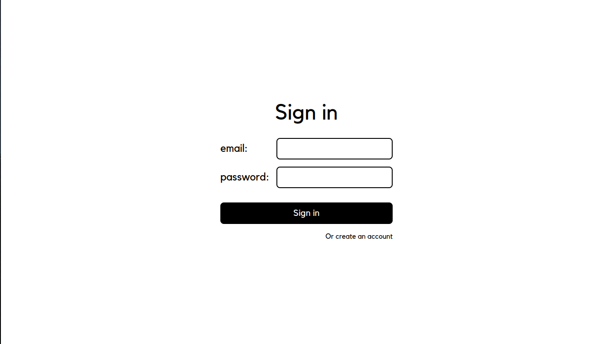

# [Pastel Notes](https://pastel-notes.vercel.app/)

A simple note taking web application built using [Next.js](https://nextjs.org/), [Tailwind CSS](https://tailwindcss.com/), [Prisma ORM](https://www.prisma.io/orm), [TypeScript](https://www.typescriptlang.org/), [PostgreSQL](https://www.postgresql.org/).

## Screenshots

- SignIn

  

- SignUp

  

- Notes

  

- Archive

  

- Trash

  

  ## Development

  1. Clone the repository and `cd` into it.

     ```bash
     git clone https://github.com/tanishkushwaha/pastel-notes.git

     cd pastel-notes
     ```

  2. Install dependencies.

     ```bash
     npm install
     ```

  3. Create a `.env` file and set the following variables:

     - `DATABASE_URL`: your PostgreSQL URI
     - `AUTH_SECRET`: your auth secret

       To generate `AUTH_SECRET` do `npx auth secret`.

     > **Note:** `.env.example` is provided in the repository for reference.

  4. Sync your database schema with `schema.prisma`.

     ```bash
     prisma db push
     ```

  5. Run the application.

     ```bash
     npm run dev
     ```
